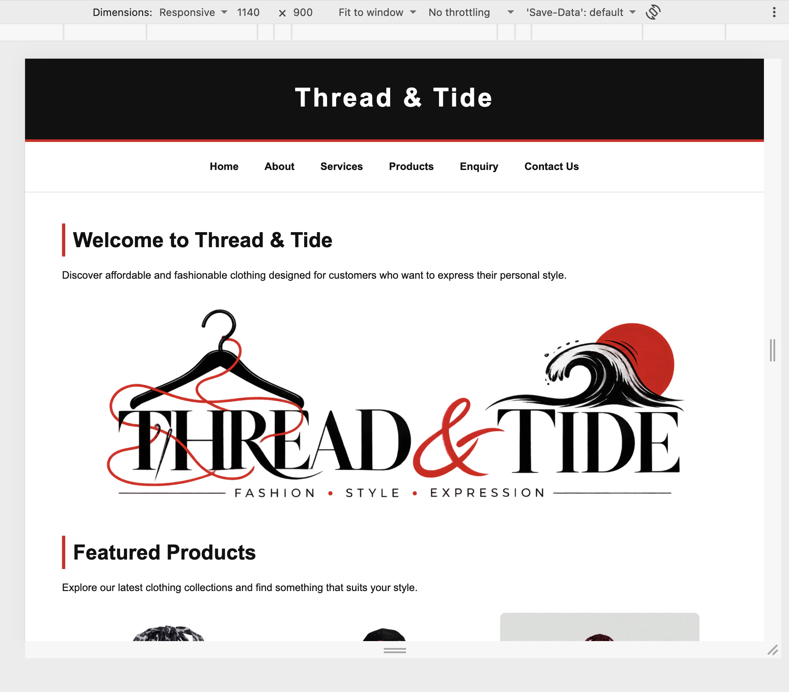
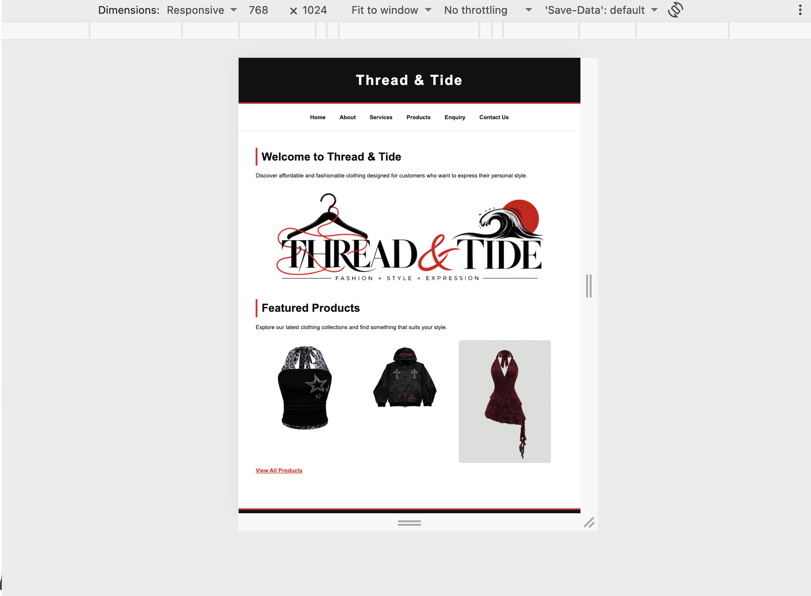
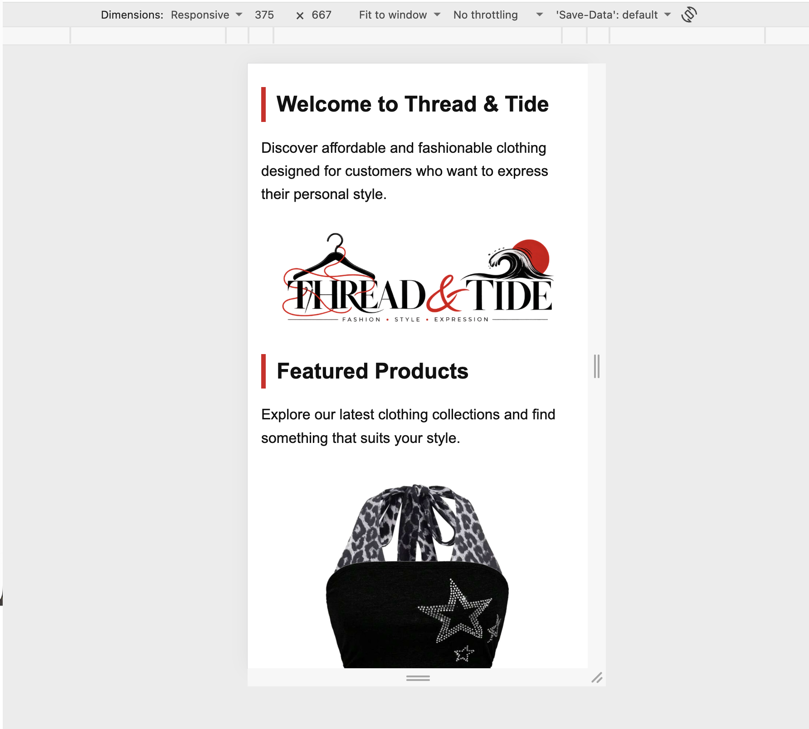

Thread-Tide
PROJECT TITLE

Thread & Tide Website

STUDENT INFORMATION

Student Name: Nicholas Ramsunder
Student Number: ST10541033
Module: WEDE5020W
Project: Part 1 Website Development

PROJECT OVERVIEW

Thread & Tide is a fictional retail clothing store aimed mainly at teenagers and young adults who are interested in affordable and trendy fashion. The website was created to give the organisation a simple online presence where customers can learn more about the store, view its products and categories, and easily find contact and enquiry information.

The website focuses on presenting the clothing range in a clear and simple way. It includes information about the organisation, its products and services, as well as a basic enquiry form and contact information.

WEBSITE GOALS AND OBJECTIVES

The main goal of the Thread & Tide website is to provide customers with an easy way to find information about the store and browse its clothing products.

The objectives of the website are to:

• Introduce Thread & Tide and explain what the store offers.
• Display clothing products and categories clearly.
• Provide customers with useful product information and images.
• Make it easy for customers to submit an enquiry.
• Provide clear contact and store information.
• Create a simple website structure that can be developed and improved in later project phases.

KEY FEATURES AND FUNCTIONALITY

The website currently includes six main pages:

Home – Introduces Thread & Tide and displays featured products.

About – Provides information about the organisation, including its mission, vision and target audience.

Services – Explains the services and customer support offered by Thread & Tide.

Products – Displays different clothing categories, including tops, bottoms, dresses, jackets and accessories.

Enquiry – Provides a form that allows customers to submit questions or requests.

Contact Us – Provides contact details, store information, opening hours and location information.

The website uses a navigation menu on each page so that users can move between the different sections easily. Images are stored in a separate images folder and are linked to the relevant HTML pages.

The website was developed using basic HTML structure. Semantic elements such as the header, navigation, main content and footer are used to keep the pages organised. The website also includes a basic HTML enquiry form.

TIMELINE AND MILESTONES

Week 1 – Finalise the organisation choice and proposal, complete the initial research, gather relevant content and images, and complete the sitemap and wireframes.

Week 2 – Create and organise the HTML pages and website folders, add the researched content, images and navigation, test all pages and links, make final corrections, organise the evidence and prepare the Part 1 submission.

PART 1 DETAILS

Part 1 focuses on planning, research and creating the basic HTML structure of the Thread & Tide website.

The completed Part 1 work includes:

• Two organisation proposals.
• ICE Task 1.
• ICE Task 2.
• Selection of Thread & Tide as the chosen organisation.
• Research and competitor research.
• Website goals and objectives.
• Target audience information.
• Sitemap.
• Website wireframes.
• Basic HTML website structure.
• Six HTML pages.
• Website images and logo.
• Working navigation between pages.
• Basic enquiry form.
• Testing of the completed website.

The six HTML pages created for Part 1 are:

index.html
About.html
Services.html
Products.html
Enquiry.html
Contact Us.html

SITEMAP

Please refer to folder.

The navigation menu allows users to move between all six pages.

CHANGELOG

Part 1

• Created the initial Thread & Tide website structure.
• Added the Home page.
• Added the About page.
• Added the Services page.
• Added the Products page.
• Added the Enquiry page.
• Added the Contact Us page.
• Added the Thread & Tide logo.
• Added product and website images.
• Created the website navigation.
• Added the basic enquiry form.
• Added contact and store information.
• Created the sitemap and wireframes.
• Tested the website navigation and image links.
• Organised the website files into the required folders.

REFERENCES

MDN Web Docs (2026) HTML: HyperText Markup Language. Available at: https://developer.mozilla.org/en-US/docs/Web/HTML

MDN Web Docs (2026) HTML forms. Available at: https://developer.mozilla.org/en-US/docs/Learn_web_development/Core/Structuring_content/HTML_forms 

PART 2 – WEBSITE STYLING AND RESPONSIVE DESIGN

PART 2 OVERVIEW

Part 2 focused on improving the Thread & Tide website by adding CSS styling and responsive design. An external CSS stylesheet was created and applied to all website pages to improve the overall appearance, layout and consistency of the website.

The website was styled using a black, white and red colour scheme. CSS was used to control typography, spacing, navigation, images, forms, buttons and product cards.

STYLING AND LAYOUT

An external stylesheet called style.css was created for the website.

The stylesheet includes:

• CSS reset and base styling.
• Font family, font size, font weight and line height.
• Website colours and backgrounds.
• Navigation styling.
• Image sizing and spacing.
• Form styling.
• Button styling.
• Borders, rounded corners and box shadows.
• Hover, focus and active states.
• Responsive layouts using CSS Flexbox and CSS Grid.

The Products page uses CSS Grid to display product cards. The grid changes depending on the screen size so that the products remain easy to view on different devices.

RESPONSIVE DESIGN

Responsive design was added to allow the website to adapt to different screen sizes.

The website includes breakpoints for:

• Desktop screens.
• Tablet screens.
• Mobile screens.

Media queries were used to change the navigation, product grid, images, forms, spacing and typography for smaller screens.

A viewport meta tag was also added to the HTML pages so that the website displays correctly on mobile devices.

TESTING

The website was tested at different screen sizes to check that the layout, navigation, images and content remained usable.

The following screen sizes were tested:

Desktop – 1140 × 900

Tablet – 768 × 1024

Mobile – 375 × 667

The website displayed correctly at all three tested sizes. The navigation, images, product layout and forms adapted to the different screen sizes.

TESTING SCREENSHOTS

Desktop Testing

Tablet Testing

Mobile Testing

PART 2 CHANGELOG

• Created an external style.css stylesheet.
• Added a CSS reset and base website styling.
• Added the Thread & Tide black, white and red colour scheme.
• Added typography and spacing styles.
• Styled the website navigation.
• Added hover, focus and active states.
• Added responsive image styling.
• Added CSS Grid for the product layout.
• Added product cards with borders and box shadows.
• Added desktop, tablet and mobile media queries.
• Improved form and button styling.
• Added mobile viewport settings.
• Tested the website at desktop, tablet and mobile screen sizes.
• Added screenshots showing responsive testing.

REFERENCES

MDN Web Docs (2026) CSS: Cascading Style Sheets. Available at: https://developer.mozilla.org/en-US/docs/Web/CSS

MDN Web Docs (2026) CSS Grid Layout. Available at: https://developer.mozilla.org/en-US/docs/Web/CSS/Guides/Grid_layout

MDN Web Docs (2026) CSS Flexible Box Layout. Available at: https://developer.mozilla.org/en-US/docs/Web/CSS/Guides/Flexible_box_layout

MDN Web Docs (2026) CSS media queries. Available at: https://developer.mozilla.org/en-US/docs/Web/CSS/Guides/Media_queries